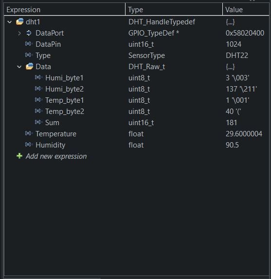

<h1>DHT11/22 temperature-humidity sensor</h1>

STM32 I2C HAL & LL library for the DHT11/22 or AM2302

These sensors are very basic and slow, interval must higher than once per second

This library need to used DwtDelay library as some waiting time need to be in microsecond

Tested on STM32H750 with DHT22

Data are store in data structure

Comment/Suggestion are highly welcome!
